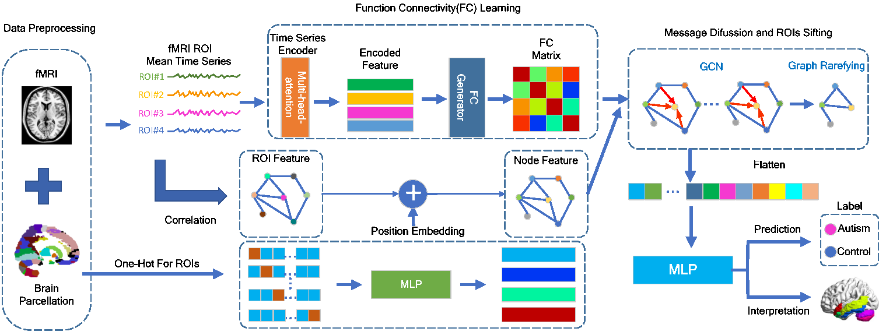
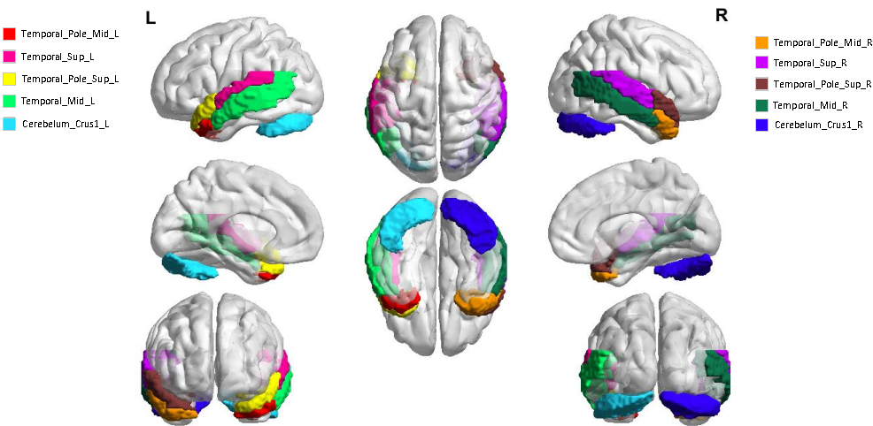

<div align="center">
<h1>PLSNet: Position-aware GCN-based autism spectrum disorder diagnosis via FC learning and ROIs sifting</h1>


[Yibin Wang](https://codegoat24.github.io)\*, Haixia Long, Qianwei Zhou, Tao Bo, [Jianwei Zheng](https://zhengjianwei2.github.io/)&#8224;

(&#8224;corresponding author)

[Zhejiang University of Technology]

Accepted by _**Computer in Biology and Medicine**_

</div>

## 📖 Abstract
Brain function connectivity, derived from functional magnetic resonance imaging (fMRI), has enjoyed high popularity in the studies of Autism Spectrum Disorder (ASD) diagnosis. Albeit rapid progress has been made, most studies still suffer from several knotty issues: (1) the hardship of modeling the sophisticated brain neuronal connectivity; (2) the mismatch of identically graph node setup to the variations of different brain regions; (3) the dimensionality explosion resulted from excessive voxels in each fMRI sample; (4) the poor interpretability giving rise to unpersuasive diagnosis. To ameliorate these issues, we propose a position-aware graph-convolution-network-based model, namely PLSNet, with superior accuracy and compelling built-in interpretability for ASD diagnosis. Specifically, a time-series encoder is designed for context-rich feature extraction, followed by a function connectivity generator to model the correlation with long range dependencies. In addition, to discriminate the brain nodes with different locations, the position embedding technique is adopted, giving a unique identity to each graph region. We then embed a rarefying method to sift the salient nodes during message diffusion, which would also benefit the reduction of the dimensionality complexity. Extensive experiments conducted on Autism Brain Imaging Data Exchange demonstrate that our PLSNet achieves state-of-the-art performance. Notably, on CC200 atlas, PLSNet reaches an accuracy of 76.4% and a specificity of 78.6%, overwhelming the previous state-of-the-art with 2.5% and 6.5% under five-fold cross-validation policy. Moreover, the most salient brain regions predicted by PLSNet are closely consistent with the theoretical knowledge in the medical domain, providing potential biomarkers for ASD clinical diagnosis.





## 🔧 Dataset


Please follow the [instruction](util/abide/readme.md) to download and process **ABIDE** dataset.

## 🔥 Run

```bash
python main.py --config_filename setting/abide_RGTNet.yaml
```

### Hyperparameters

All hyperparameters can be tuned in setting files.

```yaml
model:
  type: PLSNet
  extractor_type: attention
  embedding_size: 8
  window_size: 4

  dropout: 0.5


train:
  lr: 1.0e-4
  weight_decay: 1.0e-4
  epochs: 500
  pool_ratio: 0.7
  optimizer: adam
  stepsize: 200

  group_loss: true
  sparsity_loss: true
  sparsity_loss_weight: 0.5e-4
  log_folder: result
  
  # uniform or pearson
  pure_gnn_graph: pearson
```

## ⏬ Download the Pre-trained Models
We provide models for PLSNet_AAL and PLSNet_CC200.

<table>
  <thead>
    <tr style="text-align: right;">
      <th></th>
      <th>atlas</th>
      <th>acc.%</th>
      <th>sen.%</th>
      <th>spe.%</th>
      <th>url of model</th>
    </tr>
  </thead>
  <tbody>
    <tr>
      <th>0</th>
      <td>AAL</td>
      <td>72.4</td>
      <td>71.6</td>
      <td>71.3</td>
      <td><a href="https://pan.baidu.com/s/1K_yXsK0n01mtD1-drTqv8w">baidu disk</a>&nbsp;(code: 7fig)</td>
    </tr>
    <tr>
      <th>1</th>
      <td>CC200</td>
      <td>76.4</td>
      <td>74.7</td>
      <td>78.6</td>
      <td><a href="https://pan.baidu.com/s/1apwl5TAzrQbp8wWLdH-BLg">baidu disk</a>&nbsp;(code: pmbz)</td>
    </tr>

  </tbody>
</table>


##  🖊️ BibTeX
If you use this repository in your research, consider citing it using the following Bibtex entry:

```
@article{wang2023plsnet,
  title={PLSNet: Position-aware GCN-based autism spectrum disorder diagnosis via FC learning and ROIs sifting},
  author={Wang, Yibin and Long, Haixia and Zhou, Qianwei and Bo, Tao and Zheng, Jianwei},
  journal={Computers in Biology and Medicine},
  pages={107184},
  year={2023},
  volume={163},
  publisher={Elsevier}
}
```

## 📧 Contact

If you have any technical comments or questions, please open a new issue or feel free to contact [Yibin Wang](https://codegoat24.github.io).
